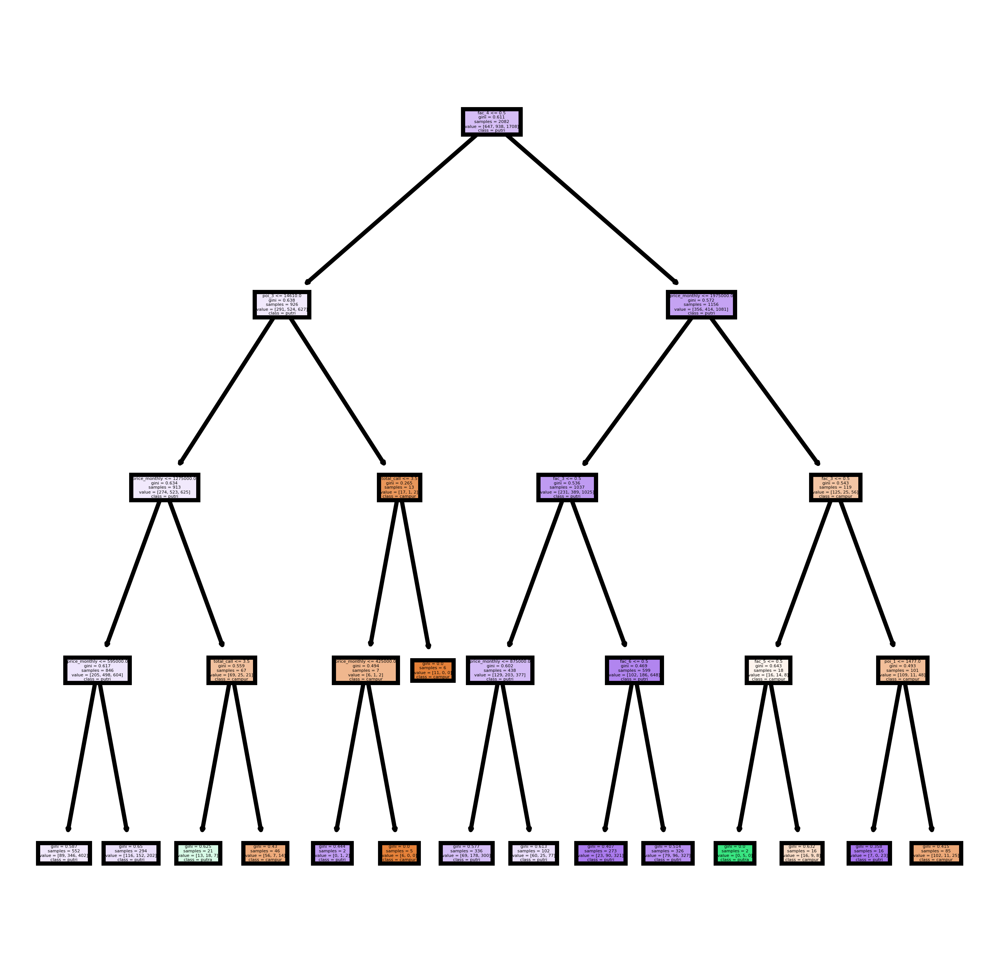

<h2> Classification of boarding house type using random forest </h2>

<h3> Dataset </h3>
Data yang digunakan pada analisis ini adalah data karakteristik kost - kost an yang terdiri dari 17 Variable yaitu sebagai berikut : 
<ul>
1.Id : id kost  
2.fac_1 - fac_8 : fasilitas kost  
3.poi_1 : jarak ke POI 1  
4.poi_2 : jarak ke POI 2  
5.poi_3 : jarak ke POI 3  
6.size : luas kamar  
7.room_count : jumlah kamar  
8.total_call : jumlah pencarian ke kost tersebut  
9.gender : jenis gender yang ditampung oleh kost tersebut </ul>

<h3> Benefits of Analysis </h3>
Pertumbuhan sektor jasa ini telah berkembang ke berbagai bidang usaha, salah satunya adalah usaha rumah kost. Banyak faktor yang menjadi pertimbangan dalam memilih rumah kost misalnya lokasi yang strategis seperti dekat dengan kampus, tempat makan, warnet, fotocopy, shopping center, ataupun tempat-tempat hiburan lainnya. Oleh karena itu, untuk membangun kos kosan harus ditentukan apakah di suatu area itu cocok untuk dibangun kos putra, putri, atau campur berdasarkan faktor-faktor tersebut. Untuk mengetahui di suatu area itu cocok untuk dibangun kos putra, putri atau campur dilakukan pemodelan menggunakan algoritma random forest
<h3> Result </h3>

Penjelasan rules dari Tree : 
<ul>
- tidak terdapat fasilitas 4 (fac_4) 
- jarak ke poi 3 >= 14610  
- total pencarian < 4 
- harga bulanan < 425 000  
maka jenis kosannya adalah untuk Putri</ul>
<ul>
- tidak terdapat fasilitas 4 (fac_4) 
- jarak ke poi 3 <= 14610 
- harga bulanan >= 1.275.000  
- total pencarian < 4  
maka jenis kosannya adalah utuk putra </ul>
<ul>
- tidak terdapat fasilitas 4 (fac_4)  
- jarak ke poi 3 <= 14610  
- harga bulanan >= 1.275.000  
- total pencarian > 4 atau  
- harga bulanan >= 425000  
maka jenis kosannya adalah untuk campuran </ul>

<h3> Conclusion </h3>
Hasil diatas menunjukan bahwa jenis kosan sangat bergantung dengan harga bulanan kosan, ukuran kosan, faktor 4 ( fasilitas ke 4), jarak ke poi ke 3 dan banyak pencarian.

